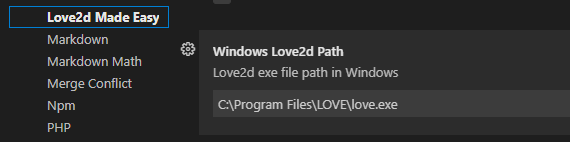

# love2d-made-easy

To simplify the Love2d game development steps and tools involved for beginners, `Love2d Made Easy` (abbr. LoveME) adds launch game button to the top menubar based on [Shortcut Menu Bar](https://marketplace.visualstudio.com/items?itemName=jerrygoyal.shortcut-menu-bar). Meanwhile, love2d code [autocomplete](https://marketplace.visualstudio.com/items?itemName=bschulte.love) is also included in this plugin for the convienence of love code input. Last but not the least, couples of code generators and boilerplates offered in love commands to help getting started quickly.

----

## Screenshots & Demos

- Click `Love2d Run` to start love2d game(main.lua required in project root folder).

- Use command to generate `main.lua`.
  - Shift + cmd + p to open commands palette
  - then input `create main.lua` and press `Enter` key

- More to coming...

## Features

- [x] love2d game Launch button
- [x] Love API autocomplete
- [x] main.lua generator
- [ ] Interactive project generator
- [ ] Sprite/GameObject/Entity/State generator

## Requirements

- main.lua file required to run love2d game
- [love2d executable program](https://love2d.org/)
- [lua-language-server plugin](https://marketplace.visualstudio.com/items?itemName=sumneko.lua)

## Extension Settings

From menu: 

- on Mac, Code/Preferences/Settings/User/Extensions/Love2d Made Easy, check/uncheck to enable/disables the buttons show up on the right top of vscode.
- on Windows, ...

## Known Issues

If any problems, please submit issues on [here](https://github.com/lwz7512/love2d-made-easy/issues)

## Release Notes

Each of release list below and features included.

### 1.0.0

Initial release of Love2d Made Easy(LoveME)

- love2d game launch button
- love2d code autocomplete
- main.lua generator

### 1.0.8

Stable version for love API autocomplete.

### 1.1.0

Windows 10+ support after one year silence. when press love2d `heart` icon, it will check os type.
If `process.platform` is `win32`, `"C:\\Program Files\\LOVE\\love.exe"` will being used to start a love2d program(main.lua). Otherwise, assume the platform is MacOSX for the time being(that means no linux support currently).

If user selected the different location to install `love2D` other than default `"C:\\Program Files\\LOVE\\love.exe"`, it's ok, open `File/Preferences/Settings/Extensions/Love2d Made Easy`, scroll down to the end of options and change the value of `Windows Love2d Path`:

@2022/01/17

## Sponsored by

  

**Enjoy!**
