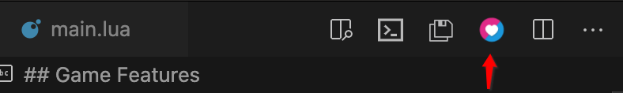
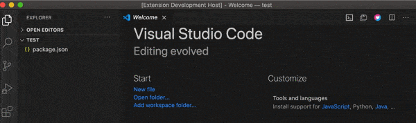

# love2d-made-easy

To simplify the Love2d game development steps and tools involved for beginners, `Love2d Made Easy` (abbr. LoveME) adds launch game button to the top menubar based on [Shortcut Menu Bar](https://marketplace.visualstudio.com/items?itemName=jerrygoyal.shortcut-menu-bar). Meanwhile, love2d code [autocomplete](https://marketplace.visualstudio.com/items?itemName=bschulte.love) is also included in this plugin for the convienence of love code input. Last but not the least, couples of code generators and boilerplates offered in love commands to help getting started quickly.

----

## Screenshots & Demos

- Click `Love2d Run` to start love2d game(main.lua required in project root folder)

- Shift + cmd + p to open commands palette, then input `create main.lua` and press `Enter` key to generate `main.lua`

- more to coming...

## Features

- [x] Launch button
- [x] Love API autocompelte
- [x] main.lua generator
- [ ] Interactive project generator
- [ ] Sprite/GameObject/Entity/State generator

## Requirements

- main.lua file required to run love2d game
- [love2d executable program](https://love2d.org/)
- [lua-language-server plugin](https://marketplace.visualstudio.com/items?itemName=sumneko.lua)

## Extension Settings

From menu: 

- on Mac, Code/Preferences/Settings/User/Extensions/Love2d Made Easy, check/uncheck to enable/disables the buttons show up on the right top of vscode.
- on Windows, ...

## Known Issues

If any problems, please submit issues on [here](https://github.com/lwz7512/love2d-made-easy/issues)

## Release Notes

Each of release list below and features included.

### 1.0.0

Initial release of Love2d Made Easy(LoveME)

### 1.0.1

Fixed issue #.

### 1.1.0

Added features X, Y, and Z.

**Enjoy!**
